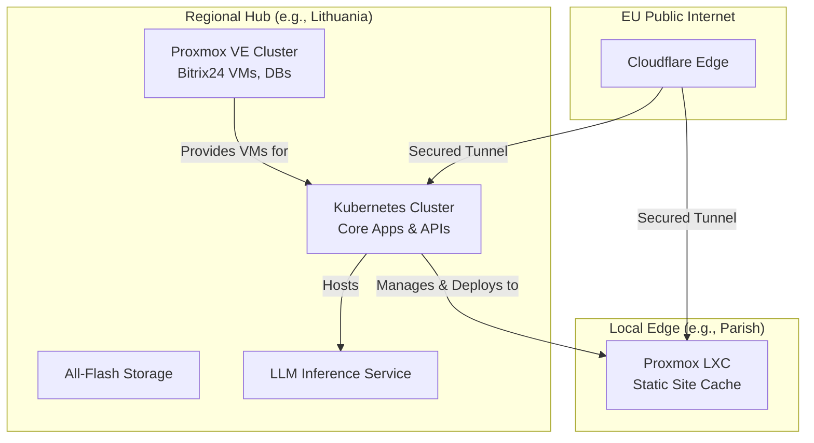

---
https://chat.deepseek.com/a/chat/s/85c84d06-54ee-4377-a30e-5c8397a5e478
---

Based on your requirements as a startup serving 400,000+ websites across the EU, here is a professional architectural framework and actionable plan. It is built on the principles of **paranoid compliance, pragmatic scalability, and cost-conscious execution**.

### 📐 High-Level Architecture & Core Principles
Your platform must be secure, sovereign, and scalable. The architecture uses a **hybrid regional hub model** to meet EU data residency laws while centralizing complex management.

**Core Design Tenets:**
*   **Data Sovereignty First:** Each major region (starting with Lithuania) gets a primary data hub. User data for `gyvenimo-kelias.lt` resides in Lithuania; data for `.pl` domains will reside in Poland.
*   **Centralized Control, Regional Presence:** Kubernetes clusters in regional hubs run core services. Simpler Proxmox LXC containers at local "edge" locations (e.g., individual large churches) host only static site caches.
*   **Zero Trust:** No system is inherently trusted. All communication requires authentication.

**Logical Architecture Overview:**

This design allows you to start in Lithuania and replicate the **Regional Hub** box for Latvia, Estonia, and Poland.

### 💰 Detailed Bill of Materials (BOM) & 3-Year Capacity Plan
This BOM is for your **first regional hub** in Lithuania. Prices are conservative estimates for budgeting.

| Component | Specific Model/Role | Qty Year 1 | Est. Cost (EUR) | Notes & Rationale |
| :--- | :--- | :--- | :--- | :--- |
| **Compute/App Nodes** | Supermicro AS-2025HS-TNR (2U, AMD EPYC) | 5 | €125,000 | Base for Proxmox/K8s. 3 for K8s workers, 2 for Proxmox VMs (Bitrix24). |
| **LLM Inference Server** | Supermicro AS-5126GS-TNRT (5U, 8x GPU) | 1 | €280,000 | Configure with 4x NVIDIA L40S GPUs (best value for inference). H100s are 2.5x cost for marginal gain at your scale. |
| **High-Perf Storage** | Supermicro SSG-229J-5BE36JBF (36 bay) | 1 | €65,000 | **Choose the 36-bay model.** It is critical for LLM vector databases and live site data. Provides essential growth runway. |
| **Network & Security** | 25/100GbE Switches, Firewall | 1 set | €40,000 | For isolated storage and secure management networks. |
| **Software & Licensing** | Proxmox, Bitrix24 On-Premise | 1 | €25,000 | Essential commercial support. |
| ****Year 1 CAPEX Estimate** | | | **€535,000** | |
| **Year 2-3 CAPEX (Additional Hubs)** | Replicate for Poland, then Baltics | 2-3 hubs | €400,000-€600,000 | Cost reduces with scale and refined configuration. |

### ⚙️ Foundational Technology Designs
Here is how the core technologies fit together in a compliant, manageable way.

**1. Kubernetes Cluster Design**
*   **Topology:** One cluster per regional hub. Use **Proxmox Kubernetes Engine (PKE)** or a managed option like **Cloudfleet** to deploy K8s directly onto your Proxmox VMs, simplifying management.
*   **Key Services:**
    *   **Ingress:** NGINX Ingress Controller, terminated by Cloudflare for DDoS protection.
    *   **Service Mesh:** Linkerd (lightweight, secure) for internal service communication.
    *   **LLM Serving:** Deploy using **NVIDIA Grove** on Kubernetes. Grove manages complex, multi-component AI systems as a single unit, which is perfect for scalable LLM inference with prefill/decode components.

**2. Proxmox Design for Edge & Core**
*   **Core Hub:** Your five Proxmox hosts form a cluster. They host: 1) VMs for the Kubernetes nodes, 2) Dedicated VMs for Bitrix24 and its PostgreSQL DB, 3) Infrastructure VMs (monitoring, auth).
*   **Local Edge:** For parishes wanting local hosting, provide a **pre-configured LXC template**. This container only caches static site content; all dynamic requests (donations, prayers) are securely proxied back to the regional hub's APIs.

**3. LLM Inference Plan**
*   **Hardware:** Start with **NVIDIA L40S GPUs** (better cost/performance for inference). Avoid H100s for now due to high cost and lead times.
*   **Deployment:** Use the **vLLM** framework orchestrated by **NVIDIA Grove** on your Kubernetes cluster. Start with a single 7B-parameter model (like Llama 3.1) for chat and copilot functions.
*   **Governance:** **LLMs must NOT administer systems autonomously.** They are **augmentation tools**. All actions must go through a human approval workflow, with full audit logging to meet the EU AI Act.

### 🛡️ Security, Compliance & Observability Blueprint
This is the "paranoid" operational core.

*   **GDPR/Compliance Plan:** Treat GDPR as your design spec. Implement controls from :
    *   **Data Map:** Classify all data (donor info, prayer requests as "special category").
    *   **Legal Basis:** Document "explicit consent" for prayers, "legitimate interest" for operations.
    *   **Procedures:** Implement **72-hour breach notification**, Subject Access Request (SAR) portals, and data retention/deletion policies.
*   **Observability Stack:** Adopt the open-source standard: **Prometheus** for metrics, **Loki** for logs, **Tempo** for traces, and **Grafana** for dashboards. This unified stack reduces cost and complexity. Use **OpenTelemetry** to instrument all applications.

### 🔄 CI/CD & Operational Runbook
*   **CI/CD & GitHub:** Single mono-repo. Use GitHub Actions. Terraform/Ansible for infrastructure. All changes to production require a pull request review.
*   **Phased Rollout Plan:**
    *   **Phase 1 (Months 1-6):** Build and harden the **Lithuania Hub**. Onboard 100 pilot churches and funeral homes. The LLM serves as a **internal copilot only**.
    *   **Phase 2 (Months 7-18):** **Replicate the hub in Poland**. This is your biggest market (~120,000 churches). Implement geo-routing via Cloudflare.
    *   **Phase 3 (Months 19-36):** Expand to remaining EU states, refining the replication playbook.

In summary, your path is to **build once in Lithuania, perfect the operational and compliance model, and then replicate that hub geographically**. This approach manages risk, controls initial cost, and builds a repeatable system for pan-European scale.

To proceed with detailed engineering on any specific component—such as the exact NVIDIA Grove configuration for LLMs or the Bitrix24 VM migration plan—please let me know where you'd like to dive deeper.