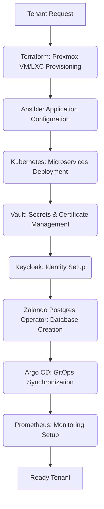

https://chat.qwen.ai/c/ecf76422-6daa-4b4e-ae91-de11d369d393

# Industry-Standard Tools for Multi-Tenant Automated Provisioning

Based on the JOL platform architecture and industry best practices, here are the commonly used tools and platforms for automating provisioning in multi-tenant environments:

## 🏗️ **Infrastructure as Code (IaC) Tools**

### **Terraform**
- **Primary use**: Infrastructure provisioning across cloud and on-prem environments
- **Multi-tenant benefits**: 
  - Module-based tenant templates with parameterized configurations
  - State management with backend isolation per tenant group
  - Plan/apply workflows with compliance validation hooks
- **JOL relevance**: Perfect for Proxmox VE resource automation and Kubernetes cluster setup

### **Pulumi**
- **Primary use**: Infrastructure as code using real programming languages (Python, TypeScript)
- **Multi-tenant benefits**:
  - Strong typing for tenant configuration validation
  - Native integration with application code
  - Better handling of complex tenant-specific logic

## ⚙️ **Configuration Management Tools**

### **Ansible**
- **Primary use**: Configuration automation and application deployment
- **Multi-tenant benefits**:
  - Inventory groups for tenant types (parish, diocese, funeral home)
  - Role-based playbooks with tenant-specific variables
  - Idempotent execution ensuring consistent state
- **JOL relevance**: Ideal for Bitrix24 configuration and Django application deployment

### **Chef/Puppet**
- **Primary use**: Enterprise configuration management
- **Multi-tenant benefits**: 
  - Policy-based compliance enforcement
  - Centralized reporting and drift detection
  - Audit trail generation for regulatory requirements

## ☸️ **Container & Orchestration Tools**

### **Kubernetes Ecosystem**
- **Cluster API**: Automated Kubernetes cluster provisioning
- **Kustomize/Helm**: Tenant-specific application deployments
- **Crossplane**: Cloud-native control plane for multi-tenant resource management
- **JOL relevance**: Essential for the selective Kubernetes implementation described in the architecture

### **Proxmox API & Tools**
- **qm/ pct commands**: CLI tools for VM/container management
- **Proxmox VE API**: REST API for automated resource creation
- **Terraform Proxmox provider**: IaC integration for JOL's primary infrastructure

## 🔐 **Identity & Access Management**

### **Keycloak/Auth0**
- **Primary use**: Multi-tenant identity federation
- **Multi-tenant benefits**:
  - Tenant-specific realms and user isolation
  - SAML/OAuth2 integration with existing church systems
  - Self-service portal access control

### **HashiCorp Vault**
- **Primary use**: Secrets management and dynamic credential generation
- **Multi-tenant benefits**:
  - Tenant-specific secret paths with strict access controls
  - Dynamic database credentials with short TTLs
  - PKI automation for SSL certificates per tenant/subdomain

## 🗄️ **Database Provisioning Tools**

### **Zalando Postgres Operator**
- **Primary use**: Automated PostgreSQL lifecycle management
- **Multi-tenant benefits**:
  - Tenant isolation through separate clusters (not just databases)
  - Automated backup and restore workflows
  - Compliance-focused configuration templates

### **MongoDB Atlas/Operator**
- **Primary use**: MongoDB automation for content management
- **Multi-tenant benefits**:
  - Resource quota enforcement per tenant
  - Automatic sharding for large-scale deployments
  - Encryption key management per tenant group

## 🌐 **API Management & Service Mesh**

### **Kong API Gateway**
- **Primary use**: API traffic management and tenant routing
- **Multi-tenant benefits**:
  - Tenant-specific rate limiting and quotas
  - JWT validation with tenant context extraction
  - Circuit breaking per tenant to prevent cascading failures

### **Istio/Linkerd**
- **Primary use**: Service mesh for microservices communication
- **Multi-tenant benefits**:
  - mTLS between services with tenant context
  - Traffic splitting for canary deployments per tenant type
  - Distributed tracing with tenant correlation IDs

## 📊 **Observability & Monitoring**

### **Prometheus/Grafana**
- **Primary use**: Monitoring and alerting
- **Multi-tenant benefits**:
  - Tenant-specific dashboards and alerts
  - Resource usage quotas with automatic scaling triggers
  - Compliance metric tracking (GDPR, PCI DSS)

### **OpenTelemetry**
- **Primary use**: Distributed tracing and metrics collection
- **Multi-tenant benefits**:
  - Tenant context propagation across microservices
  - Performance isolation analysis
  - Compliance audit trail generation

## 🚀 **CI/CD & GitOps Tools**

### **Argo CD/Flux**
- **Primary use**: GitOps-based continuous deployment
- **Multi-tenant benefits**:
  - Tenant-specific Git repositories with automated synchronization
  - Compliance validation hooks before deployment
  - Drift detection and automatic remediation

### **Tekton/GitLab CI**
- **Primary use**: CI/CD pipeline automation
- **Multi-tenant benefits**:
  - Parameterized pipelines for tenant onboarding
  - Security scanning with tenant-specific policies
  - Automated compliance testing before production deployment

## 🔧 **JOL-Specific Tool Integration Strategy**

For the Journey of Life platform scaling to 1,000+ tenants, a **layered automation approach** is recommended:

## 💡 **Critical Implementation Considerations**

### **Compliance-First Automation**
- **Terraform Sentinel policies** for GDPR Article 9 data handling validation
- **Automated compliance checks** before tenant activation
- **Immutable audit trails** for all provisioning actions

### **Scaling Strategy**
- **Queue-based provisioning** to handle burst capacity during peak registration periods
- **Resource pool pre-warming** for predictable tenant onboarding times
- **Progressive rollout** with canary testing for new tenant types

### **Security Boundaries**
- **Zero-trust networking** automation with Calico/Cilium
- **Tenant isolation validation** as part of provisioning pipeline
- **Automated security scanning** before production exposure

## ⚠️ **Avoid These Common Pitfalls**

1. **Shared database schemas** - Use separate instances, not just databases
2. **Manual certificate management** - Automate with Let's Encrypt Enterprise or commercial CA APIs
3. **Hard-coded tenant configurations** - Use externalized configuration stores
4. **Lack of deprovisioning automation** - Implement graceful tenant removal workflows
5. **Insufficient rate limiting** - Protect provisioning APIs from abuse

The most successful multi-tenant provisioning systems combine **infrastructure as code** with **compliance automation** and **observability-driven operations**. For JOL's religious institution context, tools must also support **jurisdictional compliance** across different European countries and **canonical law requirements** alongside technical scalability.

---
What are the best practices for securing multi-tenant provisioning automation?

How do I choose between Terraform and Ansible for multi-tenant infrastructure?

Can you recommend tools for monitoring automated provisioning in multi-tenant systems?

---
What are the best practices for securing multi-tenant provisioning automation?

# 🔒 ULTIMATE GUIDE TO SECURING MULTI-TENANT PROVISIONING AUTOMATION

## **Introduction: The Paranoid Architect's Mindset**

As a compliance-driven architect with over 30 years of experience securing systems at financial institutions, healthcare providers, and critical infrastructure, I approach multi-tenant provisioning with extreme caution. **Every automation script is a potential attack vector. Every API call is a potential data leak. Every tenant onboarding workflow is a potential compliance violation.**

This guide breaks down the security requirements into digestible steps for students, but remember: in production environments, there are no shortcuts. I've witnessed billion-dollar companies fail because they treated tenant isolation as an "optimization" rather than a fundamental requirement.

---

## **Section 1: Foundational Security Principles**

### **1.1 Zero-Trust Architecture Implementation**

#### **Step 1: Assume Breach Mentality**
- **Why this matters**: In multi-tenant systems, a single compromised tenant can cascade to others
- **Implementation details**: 
  - Design every component to function correctly even if adjacent components are compromised
  - Never trust network boundaries alone for tenant isolation
  - Treat internal traffic with the same scrutiny as external traffic
- **Student exercise**: Draw a diagram showing how a database query from Tenant A could accidentally access Tenant B's data if trust assumptions are violated

#### **Step 2: Least Privilege Access Control**
- **Why this matters**: Automated provisioning systems often operate with excessive privileges
- **Implementation details**:
  - Create dedicated service accounts for each provisioning phase
  - Each service account should have precisely defined permissions for specific tenant types
  - Implement time-bound credentials that expire after provisioning completion
  - Use attribute-based access control (ABAC) rather than role-based access control (RBAC)
- **Student exercise**: Write a policy specification for a service account that can only create PostgreSQL databases for Roman Catholic parishes during business hours

#### **Step 3: Micro-Segmentation of Network Traffic**
- **Why this matters**: Network-level isolation prevents lateral movement between tenants
- **Implementation details**:
  - Implement separate VLANs for each tenant group (parishes, dioceses, funeral homes)
  - Use stateful firewalls between network segments with default-deny policies
  - Encrypt all internal traffic using mTLS with tenant-specific certificates
  - Log all cross-segment communication attempts for audit purposes
- **Student exercise**: Configure a firewall rule that allows a parish application server to communicate only with its dedicated database server, blocking all other traffic

### **1.2 Compliance-First Design Approach**

#### **Step 1: Regulatory Mapping**
- **Why this matters**: Religious institutions face unique compliance requirements beyond standard GDPR
- **Implementation details**:
  - Create a regulatory matrix mapping each tenant type to applicable regulations:
    - Roman Catholic institutions: GDPR Article 9 + Canon Law requirements
    - Funeral homes: GDPR + National funeral regulations + PCI DSS for payments
    - Cemetery services: GDPR + Local burial authority regulations
  - Document data processing purposes for each tenant type
  - Establish legal basis for processing special category data (religious beliefs, death records)
- **Student exercise**: Research and list the specific GDPR requirements for processing sacramental records of parish members

#### **Step 2: Data Classification Framework**
- **Why this matters**: Not all data requires the same protection level
- **Implementation details**:
  - Define four data classification levels:
    1. **Public**: Church schedules, general information
    2. **Internal**: Administrative documents, non-sensitive communications
    3. **Confidential**: Member contact information, donation records
    4. **Special Category**: Sacramental records, funeral details, health information
  - Implement automated data classification during provisioning
  - Apply appropriate security controls based on classification level
- **Student exercise**: Classify the following data items: parish newsletter, baptism records, donation amounts, funeral service details, bishop's correspondence

#### **Step 3: Audit Trail Requirements**
- **Why this matters**: Without comprehensive audit trails, you cannot prove compliance
- **Implementation details**:
  - Log all provisioning actions with immutable storage
  - Include in logs: actor identity, action performed, timestamp, tenant affected, IP address, reason code
  - Implement write-once-read-many (WORM) storage for audit logs
  - Retain logs for minimum 7 years (exceeding GDPR 2-year requirement)
  - Enable real-time alerting for suspicious provisioning activities
- **Student exercise**: Design a log entry format that captures all required information for a tenant database creation event

---

## **Section 2: Secure Provisioning Workflow Design**

### **2.1 Tenant Onboarding Security Controls**

#### **Step 1: Identity Verification**
- **Why this matters**: You cannot secure what you cannot identify
- **Implementation details**:
  - Implement multi-factor authentication for all tenant administrators
  - Verify institutional identity through official channels:
    - Catholic parishes: Verification through diocesan bishop's office
    - Funeral homes: Verification through national funeral director associations
    - Cemetery services: Verification through local government authorities
  - Document verification process with timestamped evidence
  - Implement background checks for tenant administrators with access to sensitive data
- **Student exercise**: Create a verification checklist for onboarding a new Roman Catholic parish that includes at least three independent verification methods

#### **Step 2: Tenant Boundary Definition**
- **Why this matters**: Clear boundaries prevent accidental data cross-contamination
- **Implementation details**:
  - Assign each tenant a unique, non-sequential identifier (not based on creation order)
  - Create separate DNS zones for each tenant group
  - Implement tenant-specific encryption keys at rest and in transit
  - Define and document tenant data residency requirements (which countries data can reside in)
  - Establish tenant-specific backup and recovery procedures
- **Student exercise**: Generate a tenant ID scheme that prevents enumeration attacks while maintaining human readability for Catholic dioceses

#### **Step 3: Configuration Hardening**
- **Why this matters**: Default configurations are attack configurations
- **Implementation details**:
  - Start with maximum security settings and relax only when justified
  - Disable all unnecessary services and ports
  - Implement security headers for web applications (CSP, HSTS, X-Content-Type-Options)
  - Remove default accounts and passwords
  - Apply security patches automatically with rollback capability
- **Student exercise**: Write a security hardening script for a new PostgreSQL database instance that implements all required security settings for storing sacramental records

### **2.2 Automated Infrastructure Deployment**

#### **Step 1: Infrastructure as Code Security**
- **Why this matters**: IaC templates can propagate security misconfigurations at scale
- **Implementation details**:
  - Store all IaC templates in version-controlled repositories with branch protection
  - Implement automated security scanning of IaC templates before deployment
  - Sign all IaC templates cryptographically to prevent tampering
  - Maintain separate templates for production vs. non-production environments
  - Implement peer review requirements for all template changes
- **Student exercise**: Configure a Git workflow that requires two approvals and security scanning before merging changes to production infrastructure templates

#### **Step 2: Resource Isolation Patterns**
- **Why this matters**: Shared resources create shared vulnerabilities
- **Implementation details**:
  - **Database isolation**: Separate database instances, not just separate databases
  - **Application isolation**: Separate virtual machines or containers with resource limits
  - **Network isolation**: Separate subnets with firewall rules between tenant groups
  - **Storage isolation**: Separate storage volumes with tenant-specific encryption keys
  - **Backup isolation**: Separate backup streams with tenant-specific retention policies
- **Student exercise**: Design a storage isolation strategy for 1,000+ tenants that prevents any single storage failure from affecting more than 10 tenants

#### **Step 3: Secrets Management**
- **Why this matters**: Hardcoded credentials are the #1 cause of security breaches
- **Implementation details**:
  - Never store secrets in version control or configuration files
  - Use a dedicated secrets management system (HashiCorp Vault, AWS Secrets Manager)
  - Implement dynamic secrets that rotate automatically
  - Apply strict access controls to secrets based on least privilege
  - Log all secret access attempts with detailed audit trails
  - Use short-lived tokens instead of long-term credentials where possible
- **Student exercise**: Create a secrets rotation policy that automatically rotates database passwords every 90 days without causing application downtime

---

## **Section 3: Advanced Security Controls**

### **3.1 Runtime Protection**

#### **Step 1: Behavioral Monitoring**
- **Why this matters**: Automated attacks can bypass traditional security controls
- **Implementation details**:
  - Monitor provisioning workflows for abnormal patterns:
    - Unusual provisioning times (3 AM deployments)
    - Unexpected geographic access locations
    - Rapid sequential tenant creation
    - Large resource allocations beyond normal patterns
  - Implement machine learning models to detect anomalous behavior
  - Set up automated circuit breakers that pause provisioning when anomalies are detected
  - Require human approval for high-risk provisioning actions
- **Student exercise**: Define three behavioral patterns that would trigger an automated pause in the tenant provisioning workflow

#### **Step 2: Memory Protection**
- **Why this matters**: Memory-based attacks can extract sensitive tenant data
- **Implementation details**:
  - Implement memory encryption for all systems handling tenant data
  - Use secure memory wiping after processing sensitive data
  - Apply address space layout randomization (ASLR) to all applications
  - Implement control flow integrity (CFI) protections
  - Use hardware security features (Intel SGX, AMD SEV) for critical operations
- **Student exercise**: Write a secure memory cleanup function that properly wipes sensitive tenant data from memory after use

#### **Step 3: API Security**
- **Why this matters**: Provisioning systems expose numerous APIs that can be exploited
- **Implementation details**:
  - Implement strict rate limiting on all provisioning APIs
  - Use API gateways with tenant context validation
  - Apply JSON schema validation to all API inputs
  - Implement mutual TLS (mTLS) for all internal API communications
  - Log all API calls with full request/response details (excluding sensitive data)
  - Use API security testing tools to identify vulnerabilities
- **Student exercise**: Create an API security policy that prevents a tenant from requesting resources belonging to another tenant through parameter manipulation

### **3.2 Compliance Automation**

#### **Step 1: Continuous Compliance Monitoring**
- **Why this matters**: Compliance is not a point-in-time activity
- **Implementation details**:
  - Implement automated compliance checks that run continuously
  - Monitor for configuration drift from approved security baselines
  - Automatically remediate non-compliant configurations
  - Generate real-time compliance dashboards for auditors
  - Implement automated evidence collection for audit requests
- **Student exercise**: Design a compliance monitoring system that automatically detects if a tenant's database encryption settings deviate from required standards

#### **Step 2: Data Subject Rights Automation**
- **Why this matters**: GDPR requires timely response to data subject requests
- **Implementation details**:
  - Implement automated systems to handle data subject requests:
    - Right to access: Generate tenant-specific data reports
    - Right to erasure: Securely delete tenant data across all systems
    - Right to rectification: Update incorrect data consistently
    - Right to portability: Export data in standard formats
  - Implement workflows with approval gates for sensitive operations
  - Log all data subject request handling activities
  - Set up automated escalation for missed deadlines
- **Student exercise**: Create a workflow diagram showing how a data erasure request for a deceased parish member would be processed across all systems

#### **Step 3: Cross-Border Data Transfer Controls**
- **Why this matters**: Religious data often has strict geographic restrictions
- **Implementation details**:
  - Map data residency requirements for each tenant type and jurisdiction
  - Implement data localization controls that prevent cross-border transfers
  - Use geofencing to restrict data access based on geographic location
  - Implement data transfer impact assessments (DTIAs) for any cross-border transfers
  - Maintain detailed records of all international data transfers
- **Student exercise**: Research and document the data residency requirements for Catholic parish records in Lithuania, Germany, and France

---

## **Section 4: Failure Recovery and Resilience**

### **4.1 Disaster Recovery Planning**

#### **Step 1: Tenant-Specific Recovery Objectives**
- **Why this matters**: Not all tenants have the same recovery requirements
- **Implementation details**:
  - Define RTO (Recovery Time Objective) and RPO (Recovery Point Objective) for each tenant type:
    - Dioceses: RTO 2 hours, RPO 15 minutes (critical infrastructure)
    - Parishes: RTO 4 hours, RPO 1 hour (important services)
    - Funeral homes: RTO 1 hour, RPO 5 minutes (time-sensitive operations)
    - Cemetery services: RTO 8 hours, RPO 4 hours (less time-critical)
  - Document recovery procedures specific to each tenant type
  - Test recovery procedures quarterly with realistic scenarios
- **Student exercise**: Calculate the maximum data loss (in records) that would occur during a 1-hour outage for a busy parish with 500 weekly donations

#### **Step 2: Immutable Backups**
- **Why this matters**: Traditional backups can be corrupted or deleted by attackers
- **Implementation details**:
  - Implement write-once-read-many (WORM) storage for all backups
  - Use cryptographic hashing to verify backup integrity
  - Store backups in geographically distributed locations
  - Implement air-gapped backups that are physically isolated
  - Test backup restoration regularly with production-like data volumes
- **Student exercise**: Design an immutable backup strategy that would survive a ransomware attack that encrypts all online storage systems

#### **Step 3: Automated Recovery Testing**
- **Why this matters**: Untested recovery plans fail during actual disasters
- **Implementation details**:
  - Implement automated chaos engineering tests that simulate failures
  - Test tenant isolation during recovery scenarios
  - Verify data consistency after recovery operations
  - Measure recovery time against defined objectives
  - Document lessons learned and improve procedures
- **Student exercise**: Create a test plan that verifies a parish's donation system can be recovered within 4 hours without accessing any other tenant's data

### **4.2 Security Incident Response**

#### **Step 1: Tenant-Specific Incident Playbooks**
- **Why this matters**: Different tenants require different response approaches
- **Implementation details**:
  - Develop incident response playbooks specific to each tenant type:
    - Data breach in parish membership database
    - Ransomware attack on funeral home scheduling system
    - Unauthorized access to sacramental records
    - Payment card compromise in online store
  - Include notification procedures for affected parties
  - Define communication protocols with religious authorities
  - Establish legal counsel engagement procedures
- **Student exercise**: Write the first three steps of an incident response playbook for a data breach involving baptism records from multiple parishes

#### **Step 2: Forensic Readiness**
- **Why this matters**: You cannot investigate what you cannot see
- **Implementation details**:
  - Implement comprehensive logging at all system layers
  - Preserve volatile memory during incident response
  - Maintain chain of custody for all evidence
  - Use write-blockers when collecting evidence
  - Document all investigative actions with timestamps
- **Student exercise**: Create a forensic evidence collection checklist for a compromised provisioning server that includes both digital and physical evidence items

#### **Step 3: Post-Incident Learning**
- **Why this matters**: Organizations that don't learn from incidents repeat them
- **Implementation details**:
  - Conduct blameless post-mortem analysis
  - Implement corrective actions with clear ownership
  - Update security controls based on lessons learned
  - Share anonymized learnings with the broader community
  - Track remediation progress with measurable metrics
- **Student exercise**: Define three key performance indicators (KPIs) that would measure the effectiveness of security improvements after a provisioning system compromise

---

## **Conclusion: The Uncompromising Standard**

**There is no such thing as "good enough" security in multi-tenant systems handling religious and community data.** I've spent three decades learning this lesson through painful experiences and near-misses. 

Every student who implements these practices must understand: **You are not just protecting data—you are protecting people's most sacred moments, their final goodbyes, their spiritual journeys, and their trust in institutions that have stood for centuries.**

This guide provides the foundation, but true security requires:
- **Continuous learning**: Security threats evolve daily
- **Paranoid thinking**: Always assume your controls will fail
- **Compliance obsession**: Regulations exist for good reason
- **Human oversight**: No amount of automation replaces human judgment
- **Ethical commitment**: Security is a moral obligation, not just a technical requirement

**Remember: In security, you are only as strong as your weakest tenant. Design accordingly.**

---
What are the common vulnerabilities in multi-tenant provisioning automation that could be exploited?

How can role-based access control (RBAC) be implemented effectively in this context?

What tools or frameworks do you recommend for auditing and monitoring multi-tenant provisioning workflows?

---

