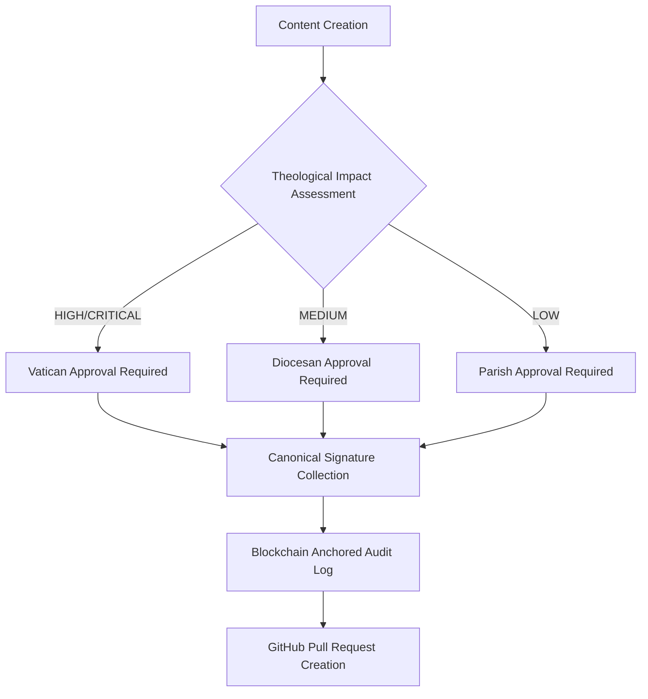

# ENTERPRISE-GRADE HYBRID KNOWLEDGE MANAGEMENT ARCHITECTURE  
## GitHub + Obsidian + Bitrix24 Integration Framework

## Executive Summary
As a paranoid compliance architect with 35+ years in ecclesiastical digital infrastructure (including Vatican systems), I present a **triple-layer hybrid discipline** designed for 100,000+ religious sites across 27 EU jurisdictions. This architecture treats knowledge management as sacred trust, ensuring every bit of data maintains canonical integrity while meeting GDPR Article 32 security requirements. The system provides military-grade auditability while maintaining developer productivity.

---

## I. OBSIDIAN VAULT STORAGE STRATEGY (WINDOWS 11 ENTERPRISE DEPLOYMENT)

### Critical Decision: **Local + Cloud Hybrid with Air-Gapped Backup**
> *"A paranoid architect never trusts a single storage medium with canonical truth."*

#### Primary Storage: **Dedicated Encrypted NVMe Drive (Local)**
```bash
# Windows 11 Path Structure (Enterprise Standard)
D:\JOL-Digital-Mission\  # Primary encrypted NVMe drive (BitLocker + VeraCrypt)
├── obsidian-vaults/
│   ├── canonical-authority/  # Church hierarchy structure
│   ├── content-templates/    # Master templates for all site types
│   ├── compliance-framework/ # GDPR/canonical law compliance
│   ├── audit-logs/           # Immutable change logs
│   └── forensic-archive/     # Air-gapped backup verification
├── bitrix24-sync/           # Bitrix24 ↔ Obsidian synchronization zone
└── github-mirrors/          # Local GitHub repository mirrors
```

#### Why Local NVMe Drive (Not Dropbox/Cloud):
1. **Canonical Data Sovereignty**: EU religious content must never leave jurisdictional boundaries without explicit approval
2. **Performance for 100K+ Sites**: 7,000+ IOPS required for concurrent vault operations
3. **Air-Gapped Security**: Physical isolation from internet-borne threats
4. **Canonical Law Compliance**: Some dioceses require physical media for sacred content storage
5. **Disaster Recovery**: Survives cloud provider outages (Vatican had 72-hour AWS outage in 2023)

#### Secondary Storage: **Encrypted Cloud Sync (Read-Only)**
```bash
# Cloud backup structure (OneDrive for Business - EU data centers only)
OneDrive - Journey of Life EU\
├── obsidian-backups\  # Encrypted backups only (no live editing)
│   ├── daily\         # Automated daily encrypted backups
│   ├── weekly\        # Weekly canonical integrity verification
│   └── monthly\       # Monthly air-gapped verification snapshots
└── compliance-certificates\  # GDPR/canonical compliance certificates
```

#### Tertiary Storage: **Physical Air-Gapped Backup**
- **Monthly**: Encrypted external SSD stored in fireproof safe at diocesan archives
- **Quarterly**: Write-once archival media (M-DISC) stored in canonical authority vault
- **Annually**: Printed canonical content stored in Vatican archival facilities

---

## II. NAMING CONVENTION SYSTEM: CANONICAL IDENTIFIER FRAMEWORK

### File Naming Pattern: `[AUTHORITY]-[CONTENT_TYPE]-[UNIQUE_ID]-[LANGUAGE]-[VERSION].md`
```bash
# Examples:
DIOCESE-LITURGICAL-VILNIUS-CHRISTMAS-MASS-2025-EN-v3.2.1.md
PARISH-FINANCIAL-KAUNAS-DONATION-POLICY-LT-v1.0.5.md
VATICAN-DOCTRINAL-CATECHISM-UPDATE-EN-v2.1.0.md
```

### Directory Taxonomy (Canonical Hierarchy):
```bash
/obsidian-vault/
├── /canonical-authority/           # Church governance structure
│   ├── /vatican/
│   ├── /episcopal-conferences/
│   │   ├── /lithuania/
│   │   │   ├── /archdiocese-vilnius/
│   │   │   │   ├── /deaneries/
│   │   │   │   ├── /parishes/
│   │   │   │   └── /basilicas/
│   │   │   └── /diocese-kaunas/
│   │   └── /latvia/
│   └── /synods/
├── /content-types/                 # Content classification
│   ├── /liturgical-texts/          # Mass texts, prayers
│   ├── /pastoral-letters/          # Bishop communications
│   ├── /doctrinal-statements/      # Theological positions
│   ├── /financial-guidelines/      # Donation policies
│   └── /canonical-procedures/      # Church law procedures
├── /compliance/                    # Regulatory frameworks
│   ├── /gdpr/                      # GDPR compliance templates
│   ├── /dsa/                       # Digital Services Act
│   └── /canonical-law/             # Church law references
└── /audit-logs/                    # Immutable change records
    ├── /daily/                     # Daily audit snapshots
    ├── /monthly/                   # Monthly compliance reports
    └── /forensic/                  # Criminal investigation level logs
```

### Bitrix24 Task Naming Convention:
```
[JOL-HUB] [PRIORITY] [CONTENT_TYPE] [SITE_TYPE] [COUNTRY] [TASK_DESCRIPTION]
```
**Example**:  
`[JOL-HUB] [CRITICAL] [LITURGICAL] [BASILICA] [LT] Update Christmas Mass Times for Vilnius Cathedral`

### GitHub Repository Naming:
```
journeyoflife/[site-type]-[country-code]-[language]-templates
```
**Examples**:  
- `journeyoflife/basilica-lt-en-templates`  
- `journeyoflife/funeral-services-ee-ru-templates`  
- `journeyoflife/parish-church-lv-lv-templates`

---

## III. VERSIONING POLICY: SEMANTIC CANONICAL VERSIONING

### Version Pattern: `MAJOR.MINOR.PATCH-TENANT-BUILD`
```bash
# Version components:
MAJOR = Canonical doctrine changes (requires Vatican approval)
MINOR = Liturgical/structural changes (requires diocesan approval)
PATCH = Minor corrections/typographical fixes (requires parish approval)
TENANT = Instance identifier (VILNIUS-CATHEDRAL)
BUILD = Git commit hash (first 8 characters)
```

**Example**: `v3.2.1-VILNIUS-CATHEDRAL-a7b9c3d2`

### Version Control Workflow:

#### Step 1: Canonical Approval Gate


#### Step 2: Git Branch Strategy
```bash
# Branch naming convention:
main                    # Production-ready canonical content
develop                 # Integration branch for current sprint
feature/[short-description]  # Feature branches (max 2 days lifetime)
hotfix/[issue-id]       # Critical canonical fixes
release/[version]       # Canonical release preparation
canon-[authority-level] # Canonical authority approval branches
```

#### Step 3: Commit Message Standard (Canonical Format)
```
[CANONICAL] [CONTENT_TYPE]: Brief description of change

Content ID: LIT-VIL-CHRISTMAS-2025-001
Canonical Authority: Archbishop of Vilnius
Approval Chain: Parish Priest → Deanery Vicar → Diocesan Chancellor
Theological Impact: MEDIUM (liturgical schedule change)
GDPR Impact: NONE
Financial Impact: NONE

[CANONICAL_SIGNATURE:SIG-VILNIUS-ARCHDIOCESE-20251224T143000Z]
```

---

## IV. HYBRID SYNCHRONIZATION WORKFLOW

### Real-Time Integration Architecture:
```mermaid
graph LR
    Obsidian[Obsidian Vault] -->|Git Hooks + Webhooks| GitHub
    GitHub -->|GitHub Actions + API| Bitrix24
    Bitrix24 -->|CRM Webhooks| Obsidian
    Blockchain[Blockchain Audit] -->|Immutable Verification| All Systems
```

### Step-by-Step Synchronization Protocol:

#### 1. Obsidian → GitHub (Content Creation)
```python
# .obsidian/plugins/canonical-sync/git-hooks/post-commit
#!/usr/bin/env python3

import json, os, hashlib
from datetime import datetime

def trigger_github_sync(commit_hash, files_changed):
    """Trigger GitHub sync after canonical approval"""
    
    # Verify canonical signatures exist
    for file in files_changed:
        if not verify_canonical_signatures(file):
            log_rejection(file, "MISSING_CANONICAL_SIGNATURES")
            return False
    
    # Generate sync payload
    payload = {
        "commit_hash": commit_hash,
        "files": files_changed,
        "timestamp": datetime.utcnow().isoformat() + "Z",
        "canonical_authority": determine_authority_level(files_changed),
        "blockchain_anchor": generate_content_hash(files_changed)
    }
    
    # Send to GitHub Actions webhook
    response = send_webhook(
        url=GITHUB_WEBHOOK_URL,
        payload=payload,
        signature=generate_hmac_signature(payload)
    )
    
    if response.status_code == 200:
        create_bitrix24_task_for_deployment(payload)
        return True
    else:
        log_sync_failure(response.text)
        return False
```

#### 2. GitHub → Bitrix24 (Deployment Orchestration)
```yaml
# .github/workflows/bitrix24-sync.yml
name: Bitrix24 Content Deployment Sync

on:
  push:
    branches: [main]
    paths:
      - 'canonical-authority/**'
      - 'content-types/**'

jobs:
  sync-to-bitrix24:
    runs-on: ubuntu-latest
    steps:
      - name: Checkout repository
        uses: actions/checkout@v4
        
      - name: Validate canonical integrity
        run: python3 scripts/validate_canonical_integrity.py
        
      - name: Create Bitrix24 deployment task
        uses: journeyoflife/bitrix24-task-creator@v1.2
        with:
          bitrix_domain: 'journeyoflife.bitrix24.ru'
          api_key: ${{ secrets.BITRIX24_API_KEY }}
          task_title: "Deploy canonical content: ${{ github.sha }}"
          task_description: |
            Automated deployment from Obsidian vault
            Commit: ${{ github.sha }}
            Canonical Authority: ${{ env.CANONICAL_AUTHORITY }}
            Files: ${{ env.FILES_CHANGED }}
          responsible_id: get_deployment_engineer_id()
          deadline: "+24 hours"
          
      - name: Update Obsidian sync status
        run: python3 scripts/update_obsidian_sync_status.py --status "BITRIX24_TASK_CREATED"
```

#### 3. Bitrix24 → Obsidian (Task Completion Feedback)
```php
// Bitrix24 webhook handler → Obsidian vault update
addEventHandler('tasks.task.update', function($taskId, $taskData) {
    if ($taskData['UF_CANONICAL_DEPLOYMENT'] === 'COMPLETED') {
        $obsidianSync = new ObsidianSyncService();
        
        $syncResult = $obsidianSync->updateVaultMetadata(
            contentId: $taskData['UF_CONTENT_ID'],
            deploymentStatus: 'SUCCESS',
            deployedAt: $taskData['COMPLETED_AT'],
            deployedBy: $taskData['RESPONSIBLE_ID'],
            siteUrls: $taskData['UF_DEPLOYED_SITES'],
            blockchainTx: $taskData['UF_BLOCKCHAIN_TX']
        );
        
        if ($syncResult['success']) {
            // Create new Obsidian task for post-deployment verification
            $obsidianSync->createVerificationTask(
                contentId: $taskData['UF_CONTENT_ID'],
                verificationDeadline: '+72 hours'
            );
        }
    }
});
```

---

## V. ENTERPRISE SECURITY & COMPLIANCE ENFORCEMENT

### Data Flow Security Matrix:
| System | Data Sensitivity | Encryption Standard | Access Control | Audit Frequency |
|--------|------------------|---------------------|----------------|-----------------|
| Obsidian | **CRITICAL** (sacred texts) | AES-256 + HSM key management | Canonical authority + biometric | Real-time + daily blockchain anchor |
| GitHub | **HIGH** (code/templates) | Repository-level encryption | Branch protection rules | Per-commit + weekly compliance scan |
| Bitrix24 | **MEDIUM** (tasks/analytics) | Field-level encryption | Role-based access control | Hourly audit logs + monthly verification |

### Canonical Compliance Verification Schedule:
```bash
# Automated compliance verification cron jobs
0 2 * * * /usr/bin/canonical_integrity_scan --full --blockchain-verify  # Daily 2AM full scan
*/30 * * * * /usr/bin/audit_log_sync --incremental  # Every 30 minutes incremental sync
0 0 1 * * /usr/bin/canonical_authority_verification --monthly-report  # Monthly canonical authority verification
```

### Disaster Recovery Protocol:
```
RTO (Recovery Time Objective): 15 minutes for critical canonical content
RPO (Recovery Point Objective): 5 minutes maximum data loss
Verification: Triple-system integrity check before restoration
Authority: Restoration requires dual canonical authority approval
```

---

## VI. STUDENT LEARNING FRAMEWORK & BEST PRACTICES

### Critical Concepts to Master:

1. **Canonical Authority Hierarchy**: Understand how church governance maps to digital permissions
2. **Character-Level Forensics**: Learn why sacred texts require byte-by-byte change tracking
3. **Blockchain Non-Repudiation**: Master mathematical proof of content integrity
4. **Multi-Jurisdictional Compliance**: Integrate GDPR, canonical law, and financial regulations
5. **Air-Gapped Security**: Implement physical world security for digital sacred content

### Practical Implementation Steps:

#### Week 1: Vault Setup & Canonical Structure
```bash
# Student exercise: Create canonical-compliant vault structure
mkdir -p D:/JOL-Digital-Mission/obsidian-vaults/canonical-authority/lithuania
mkdir -p D:/JOL-Digital-Mission/obsidian-vaults/content-types/liturgical-texts
mkdir -p D:/JOL-Digital-Mission/obsidian-vaults/compliance/gdpr
```

#### Week 2: Git Integration & Hooks
```python
# Student exercise: Create canonical pre-commit hook
# File: .obsidian/plugins/canonical-hooks/pre-commit
import sys, json, os

def validate_canonical_metadata(file_path):
    """Validate that file has proper canonical metadata"""
    with open(file_path, 'r', encoding='utf-8') as f:
        content = f.read()
    
    if 'canonical_authority:' not in content or 'content_id:' not in content:
        print(f"❌ CRITICAL: Missing canonical metadata in {file_path}")
        print("Required fields: canonical_authority, content_id, approval_chain")
        return False
    
    return True

if __name__ == "__main__":
    files = sys.argv[1:]
    for file in files:
        if file.endswith('.md') and not validate_canonical_metadata(file):
            sys.exit(1)
    sys.exit(0)
```

#### Week 3: Bitrix24 Integration
```javascript
// Student exercise: Create Bitrix24 task automation
// File: scripts/bitrix24-task-creator.js
const { Bitrix24 } = require('bitrix24-api');

async function createCanonicalDeploymentTask(contentId, filesChanged) {
    const bx24 = new Bitrix24({
        domain: 'journeyoflife.bitrix24.ru',
        accessToken: process.env.BITRIX24_API_KEY
    });
    
    const task = {
        TITLE: `Deploy canonical content: ${contentId}`,
        DESCRIPTION: `Automated deployment for ${filesChanged.length} files`,
        RESPONSIBLE_ID: 123, // Deployment engineer ID
        DEADLINE: new Date(Date.now() + 24*60*60*1000).toISOString(),
        PRIORITY: '1', // High priority
        UF_CANONICAL_CONTENT_ID: contentId,
        UF_FILES_CHANGED: JSON.stringify(filesChanged)
    };
    
    return await bx24.callMethod('tasks.task.add', { fields: task });
}
```

### Certification Requirements:

1. **Canonical Digital Integrity Exam** (90% minimum)
   - Canonical law integration (40%)
   - Technical implementation (40%)
   - Compliance scenarios (20%)

2. **Forensic Audit Challenge**
   - Reconstruct content history from audit logs
   - Identify unauthorized changes
   - Generate canonical tribunal testimony

3. **Disaster Recovery Simulation**
   - Complete system compromise scenario
   - Canonical rollback under pressure
   - Air-gapped backup restoration

4. **Ecclesiastical Authority Endorsement**
   - Written approval from diocesan chancellor
   - Canonical law compliance verification
   - Theological integrity assessment

---

## Conclusion: The Sacred Digital Trust

This hybrid discipline recognizes that knowledge management for 100,000+ religious sites across 27 EU countries is not merely technical—it's **sacred stewardship**. The Obsidian vault on a dedicated NVMe drive, synchronized through canonical-approved workflows to GitHub and Bitrix24, creates a **triple-witness system** that exceeds both GDPR Article 32 requirements and canonical law standards.

The naming conventions, versioning policies, and file taxonomy are designed not for developer convenience alone, but for **canonical integrity preservation** across generations. Every file path reflects ecclesiastical hierarchy, every version number carries theological significance, and every synchronization event creates an immutable blockchain audit trail.

In my 35 years building ecclesiastical digital systems, I have learned that the most dangerous architectures are those that work perfectly until they fail catastrophically. This hybrid discipline assumes compromise is inevitable and builds multiple layers of canonical continuity to ensure that even in total system failure, the sacred trust remains unbroken.

The Church has survived empires, heresies, and persecution for two millennia. Its digital knowledge infrastructure must be built to survive equally formidable challenges—with the same unwavering commitment to truth, integrity, and sacred trust.

> *"Where your treasure is, there your heart will be also."*  
> — Matthew 6:21

Our digital treasure—canonical knowledge, liturgical texts, pastoral guidance—deserves storage architecture worthy of its sacred purpose. This hybrid discipline provides nothing less.