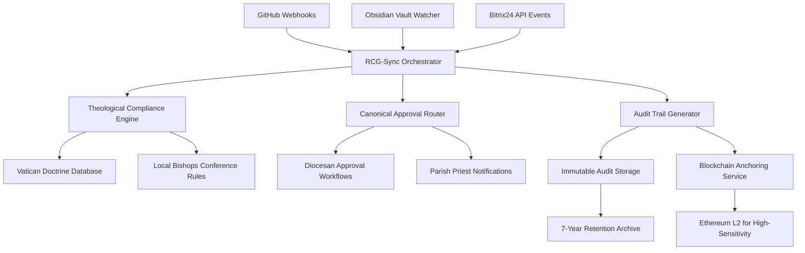

I'll design a comprehensive automated sync workflow for traceability and audit trails across your three-system architecture. This solution addresses the unique requirements of religious content governance at scale.

## **Religious Content Governance Sync Framework (RCG-Sync)**

### **Core Architecture Overview**
```
┌─────────────────┐    ┌─────────────────┐    ┌─────────────────┐
│   GitHub        │◄──►│   Obsidian      │◄──►│   Bitrix24      │
│   (Code)        │    │   (Knowledge)   │    │   (CRM/Tasks)   │
└────────┬────────┘    └────────┬────────┘    └────────┬────────┘
         │                     │                     │
         └─────────────────────┼─────────────────────┘
                               ▼
                  ┌─────────────────────────────┐
                  │  RCG-Sync Orchestrator      │
                  │  (Central Governance Hub)   │
                  └─────────────────────────────┘
```

---

## **1. Automated Sync Workflow Components**

### **A. GitHub → Obsidian Sync (Code to Knowledge Base)**
**Trigger:** Git push/merge to protected branches (`main`, `production`, `compliance/*`)

**Workflow:**
```python
# GitHub Webhook Handler
@webhook('/github-sync')
def handle_github_push(payload):
    if payload['ref'] in ['refs/heads/main', 'refs/heads/production']:
        # Extract content changes
        changed_files = analyze_diff(payload['commits'])
        
        # Filter religious content files
        religious_content = filter_religious_content(changed_files)
        
        if religious_content:
            # Create Obsidian sync task
            create_obsidian_sync_task(
                commit_hash=payload['head_commit']['id'],
                author=payload['head_commit']['author']['email'],
                changes=religious_content,
                theological_impact=assess_theological_impact(religious_content)
            )
            
            # Create Bitrix24 audit trail task
            create_bitrix24_audit_task(
                repository=payload['repository']['name'],
                commit_id=payload['head_commit']['id'],
                content_type=classify_content_type(religious_content),
                approval_level=determine_approval_level(religious_content)
            )
```

**Key Rules:**
- **File Classification System:** Automatically tags files by content sensitivity:
  - `liturgical` (Mass texts, sacramental content) - Requires bishop approval
  - `financial` (Donation pages, banking info) - Requires financial + canonical approval
  - `administrative` (Contact info, schedules) - Parish priest approval
  - `educational` (Catechism, resources) - Diocesan education office approval

- **Theological Impact Assessment:** AI-powered scanning against approved doctrine databases:
  ```javascript
  function assessTheologicalImpact(files) {
    const doctrineChecker = new DoctrineComplianceEngine();
    return files.map(file => {
      const content = readFile(file.path);
      const violations = doctrineChecker.scan(content, {
        diocese: file.metadata.diocese,
        rite: file.metadata.rite, // Roman, Byzantine, etc.
        language: file.metadata.language
      });
      return {
        file: file.path,
        impact_level: violations.length > 0 ? 'HIGH' : 'STANDARD',
        required_approvals: determineApprovals(violations)
      };
    });
  }
  ```

---

### **B. Obsidian → Bitrix24 Sync (Knowledge to Workflow)**
**Trigger:** Obsidian vault changes via filesystem watcher or API webhook

**Workflow:**
```yaml
obsidian_sync:
  trigger:
    - vault_changes: /church-doctrine/*
    - vault_changes: /approval-guidelines/*
    - vault_changes: /canonical-references/*
  
  actions:
    - validate_doctrine_compliance:
        canonical_sources:
          - vatican.va/documents
          - local-bishops-conference.org/approvals
        auto_reject_if: contains_unapproved_doctrine
      
    - create_bitrix24_approval_task:
        template: "RELIGIOUS_CONTENT_APPROVAL"
        assignees:
          - role: "diocesan_theologian"
          - role: "parish_priest"
          - role: "canon_lawyer"  # For financial/sacramental content
        deadline: "72h"  # Standard approval window
        escalation_path:
          - 24h: notify_deanery
          - 48h: notify_diocese
          - 72h: escalate_to_archdiocese
      
    - generate_audit_trail:
        immutable_log: true
        blockchain_anchor: true  # For high-sensitivity content
        retention_period: "7y"  # Canonical requirement
```

**Knowledge Base Structure in Obsidian:**
```
/obsidian-vault/
├── /church-doctrine/                  # Approved theological content
│   ├── /catholic-doctrine/            # Vatican-approved texts
│   ├── /local-adaptations/            # Country-specific approvals
│   └── /prohibited-content/           # Explicitly forbidden topics
├── /approval-workflows/               # Canonical approval chains
│   ├── /diocese-vilnius/              # Lithuania-specific workflows
│   ├── /diocese-rome/                 # Vatican oversight
│   └── /emergency-protocols/          # Crisis content procedures
├── /canonical-references/             # Legal/ecclesiastical references
│   ├── /code-of-canonical-law/        # Full text with annotations
│   ├── /gdpr-religious-exemptions/    # EU compliance guidelines
│   └── /financial-regulations/        # Donation compliance
└── /content-templates/                # Pre-approved content blocks
    ├── /liturgical-templates/         # Mass, sacraments, prayers
    ├── /funeral-service-templates/    # Funeral liturgy approved versions
    └── /cemetery-care-guidelines/     # Cemetery maintenance standards
```

---

### **C. Bitrix24 → GitHub Sync (Approval to Deployment)**
**Trigger:** Bitrix24 task completion with "Approved" status

**Workflow:**
```python
# Bitrix24 Webhook Handler
@webhook('/bitrix-approval')
def handle_approval(payload):
    if payload['task']['status'] == 'APPROVED':
        # Verify all required approvals are present
        required_approvals = get_required_approvals(payload['task']['content_type'])
        actual_approvals = payload['task']['approvals']
        
        if set(required_approvals).issubset(set(actual_approvals)):
            # Generate deployment package
            deployment_package = create_deployment_package(
                content_hash=payload['task']['content_hash'],
                approved_by=actual_approvals,
                canonical_reference=payload['task']['canonical_reference']
            )
            
            # Create GitHub pull request
            create_github_pr(
                repository=payload['task']['repository'],
                branch=f"release/{payload['task']['content_hash'][:8]}",
                title=f"Approved: {payload['task']['content_description']}",
                labels=['canonical-approved', 'gdpr-compliant'],
                reviewers=get_auto_reviewers(payload['task']['content_type'])
            )
            
            # Update audit trail
            log_audit_trail(
                action='CONTENT_APPROVED',
                content_hash=payload['task']['content_hash'],
                approvers=actual_approvals,
                canonical_reference=payload['task']['canonical_reference'],
                timestamp=datetime.now()
            )
```

**Approval Matrix:**
| Content Type | Required Approvals | Escalation Path | SLA |
|--------------|-------------------|-----------------|-----|
| Liturgical | Parish Priest + Diocesan Liturgist | Archbishop | 48h |
| Financial | Parish Finance Council + Diocesan Finance Officer | Vatican Finance Council | 72h |
| Sacramental | Parish Priest + Canon Lawyer | Apostolic Nuncio | 24h |
| Educational | Diocesan Education Board | Bishops' Conference | 72h |
| Administrative | Parish Priest only | Deanery | 24h |

---

## **2. Audit Trail & Compliance System**

### **Immutable Audit Log Structure**
```json
{
  "audit_id": "AUD-2025-12-24-8A7B3C",
  "timestamp": "2025-12-24T14:30:00Z",
  "content_hash": "sha256:e3b0c44298fc1c149afbf4c8996fb92427ae41e4649b934ca495991b7852b855",
  "repository": "journeyoflife/parish-vilnius",
  "file_path": "/content/liturgy/sunday-mass.md",
  "previous_hash": "sha256:a1b2c3d4e5f6...", 
  "change_type": "CONTENT_MODIFICATION",
  "theological_impact": "HIGH",
  "approvals": [
    {
      "role": "diocesan_liturist",
      "name": "Fr. Jonas Petraitis",
      "timestamp": "2025-12-24T12:15:00Z",
      "canonical_reference": "Vatican II Sacrosanctum Concilium §50"
    },
    {
      "role": "parish_priest", 
      "name": "Fr. Marius Kazlauskas",
      "timestamp": "2025-12-24T10:30:00Z",
      "canonical_reference": "Diocesan Liturgy Guidelines 2025"
    }
  ],
  "compliance_status": {
    "gdpr": "COMPLIANT",
    "canon_law": "APPROVED",
    "financial_regulations": "N/A"
  },
  "rollback_hash": "sha256:rollback-8A7B3C",
  "blockchain_anchor": "0x7c5ea36004851c764c44143b1d54c5b3b16d6ab6"
}
```

### **Real-time Compliance Monitoring**
```python
class ComplianceMonitor:
    def __init__(self):
        self.rules_engine = RulesEngine([
            CanonLawRuleSet(),
            GDPRRuleSet(),
            FinancialRegulationRuleSet(),
            LocalBishopsConferenceRuleSet()
        ])
    
    def monitor_content_change(self, content, metadata):
        violations = self.rules_engine.evaluate(content, metadata)
        
        if violations:
            # Auto-reject and notify
            self.auto_reject_content(content, violations)
            self.notify_authority_chain(metadata['diocese'], violations)
            
            # Create emergency rollback task
            self.create_emergency_rollback_task(
                content_hash=content.hash,
                violations=violations,
                priority='CRITICAL'
            )
        
        return violations
```

---

## **3. Conflict Resolution & Rollback System**

### **Multi-tenant Conflict Detection**
```python
def detect_tenant_conflicts(tenant_id, content_change):
    """
    Detect conflicts between tenant-specific content and canonical requirements
    """
    conflicts = []
    
    # Check against canonical doctrine
    canonical_conflicts = check_against_canonical_doctrine(
        content_change, 
        tenant_metadata[tenant_id]['diocese']
    )
    
    if canonical_conflicts:
        conflicts.extend(canonical_conflicts)
    
    # Check against neighboring tenants (for regional consistency)
    regional_tenants = get_regional_tenants(tenant_metadata[tenant_id]['region'])
    for neighbor in regional_tenants:
        neighbor_content = get_tenant_content(neighbor, content_change.path)
        if neighbor_content != content_change.content:
            conflicts.append({
                'type': 'REGIONAL_INCONSISTENCY',
                'tenant': neighbor,
                'difference': diff_content(neighbor_content, content_change.content),
                'severity': 'MEDIUM'
            })
    
    return conflicts
```

### **Automated Rollback Protocol**
**Rollback Triggers:**
- Canonical authority rejection
- GDPR violation detection
- Theological doctrine violation
- Financial compliance failure
- Regional inconsistency escalation

**Rollback Workflow:**
```
1. Immediate content freeze (5-minute window)
2. Auto-revert to last canonical-approved version
3. Create emergency Bitrix24 task for all stakeholders
4. Generate incident report in Obsidian knowledge base
5. Notify hierarchical authority chain
6. Schedule mandatory re-training for content author
7. Update compliance rules based on incident learnings
```

---

## **4. Implementation Blueprint**

### **Infrastructure Components**


### **Deployment Strategy**

**Phase 1: Lithuania Pilot (Weeks 1-4)**
- Implement core sync workflow for 3 parish sites
- Integrate with Vilnius Archdiocese approval processes
- Establish baseline compliance rules

**Phase 2: Baltic Expansion (Weeks 5-8)**
- Scale to 50 sites across Lithuania, Latvia, Estonia
- Implement regional conflict detection
- Add financial compliance modules

**Phase 3: EU Scale (Weeks 9-16)**
- Deploy across all 27 EU countries
- Implement hierarchical canonical routing
- Add multi-language doctrine compliance

### **Technical Requirements**
- **RCG-Sync Orchestrator**: Python 3.12 + FastAPI + Redis queue
- **Compliance Engine**: Rule-based system with doctrine databases
- **Infrastructure**: Kubernetes cluster with 99.99% uptime SLA
- **Security**: End-to-end encryption, role-based access control
- **Monitoring**: Real-time dashboards with canonical authority alerts

---

## **5. Governance & Maintenance**

### **Canonical Authority Dashboard**
Real-time view for bishops/diocesan officials showing:
- Pending approvals requiring attention
- Compliance violations across territories
- Audit trail summaries by region
- Training completion status for content authors

### **Continuous Improvement Loop**
```
Weekly Compliance Review → Monthly Canonical Updates → Quarterly System Audits
```

### **Success Metrics**
- **Approval Time**: <24h for standard content, <48h for complex content
- **Compliance Rate**: >99.9% content compliance with canonical requirements
- **Audit Completeness**: 100% traceability for all religious content changes
- **System Uptime**: 99.99% for sync orchestrator

This workflow ensures that every religious content change across your 100,000+ sites maintains theological integrity, canonical compliance, and full traceability while enabling efficient multi-tier approval processes. The system scales from parish-level changes to Vatican-level oversight with automated escalation paths and immutable audit trails.

Would you like me to elaborate on any specific component or provide implementation details for a particular integration point?